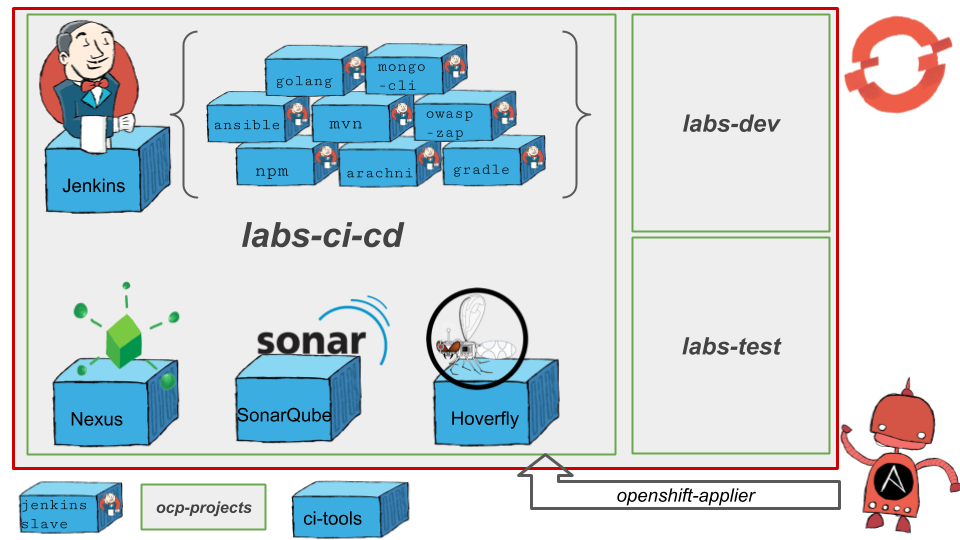

# Open Innovation Labs CI/CD

## What's in the box?

This project is an Ansible inventory for loading an OpenShift cluster with some frequently used projects, apps & tools on a Red Hat Open Innovation Lab residencies. Using the `openshift-applier`, cluster content is loaded from templates & param files in a repeatable, config-as-code way.

 Running this Ansible inventory will first create three project namespaces `labs-ci-cd`, `labs-dev` && `labs-test`. Subsequently it will create a bunch of commonly used `ci-cd-tools` such as Jenkins, Nexus & Sonar. It will also create a collection of `jenkins-slaves` that can be used in builds such as `npm`, `maven` and `golang` to name a few. Apps can also be added by applying their `Jenkinsfile` as a buildConfig with an example (java-app) included as a reference.

 The diagaram below shows the components that get created by running the playbook's `bootstrap` & `tools` inventories.


## How it Works
The layout of the project is like most standard `ansible-playbooks` with a simplified view of the key parts shown below:
```bash
.
├── apply.yml
├── requirements.yml
├── docker
│   └── sonarqube
├── inventory
│   ├── host_vars
│   |   └── ...
│   └── hosts
├── openshift-templates
│   ├── jenkins-s2i-build
│   └── ...
├── params
│   ├── projectrequests
│   ├── jenkins-slaves
│   |   └── **
│   └── ...
└── s2i-config
    └── jenkins-master
```
 * `apply.yml` is a playbook that sets up some variables and drives the openShift-applier role.
 * `requirements.yml` is a manifest which contains the Ansible modules needed to run the playbook 
 * `docker` folder contains our Docker image customisations and are built in the cluster
 * `inventory/host_vars/*.yml` is the collection of objects we want to insert into the cluster written according to [the convention defined by the openshift-applier role](https://github.com/redhat-cop/openshift-applier/tree/master/roles/openshift-applier#sourcing-openshift-object-definitions).
 * `inventory/hosts` is where the `targets` are defined for grouping of the various inventories to be run eg `bootsrap` for creating projects & roles bindings
 * `openshift-templates` is a set [OpenShift templates](https://docs.openshift.com/container-platform/3.6/dev_guide/templates.html) to be sourced from the inventory. OpenShift provides a lot of templates out of the box, so these are only to fill in gaps. If possible, reuse or update these templates before writing new ones.
 * `params` is a set of [parameter files](https://docs.openshift.com/container-platform/;latest/dev_guide/templates.html#templates-parameters) to be processed along with their respective OpenShift template. The convention here is to group files by their application.
 * `jenkins-s2i` contains the configuration and plugins we want to bring jenkins to life with

### Multiple inventories
The Ansible layer is very thin; it simply provides a way to orchestrate the application of [OpenShift templates](https://docs.openshift.com/container-platform/latest/dev_guide/templates.html) across one or more [OpenShift projects](https://docs.openshift.com/container-platform/latest/architecture/core_concepts/projects_and_users.html#projects). All configuration for the applications should be defined by an OpenShift template and the corresponding parameters file.

There are multiple Ansible inventories which divide the type of components to be built and deployed to an OpenShift cluster. These are broken down into three sections:
* `bootstrap` - Located in `inventory/host_vars/projects-and-policies.yml` contains a collection of objects used to create project namespaces and bind roles to groups for those namespace in OpenShift
* `tools` -  Located in `inventory/host_vars/ci-cd-tooling.yml` contains the collection of Jenkins slaves, Jenkins S2I and other CI/CD tooling deployments such as SonarQube, Nexus and others.
* `apps` - Located in `inventory/host_vars/app-build-deploy.yml` contains definitions for the Java reference app's build and deploy


## Getting Started With Docker

There are two ways to use Labs CI/CD. The preferred approach is to run the playbook using a docker container. This ensures consistency of the execution environment for all users. If you have the prerequisites installed feel free to read the [Getting Started Without Docker section](#getting-started-without-docker).

### Prerequisites

* [Docker CE](https://www.docker.com/community-edition#/download)
* [OpenShift CLI Tools](https://docs.openshift.com/container-platform/latest/cli_reference/get_started_cli.html)
* Access to the OpenShift cluster (Your user needs permissions to deploy ProjectRequest objects)

### Usage

1. Log on to an OpenShift server `oc login -u <user> https://<server>:<port>/`
2. Clone this repository.
3. If `labs-ci-cd` doesn't yet exist on your OpenShift cluster, just run the default `run.sh` script:
```bash
./run.sh
```

## Getting Started Without Docker

It's possible that you cannot run docker on your machine or don't want to run this inventory from a Container. No fear, this was the common way of using Labs CI/CD for a long time.

### Prerequisites 

* [Ansible](http://docs.ansible.com/ansible/latest/intro_installation.html) 2.5 or above.
* [OpenShift CLI Tools](https://docs.openshift.com/container-platform/latest/cli_reference/get_started_cli.html)
* Access to the OpenShift cluster (Your user needs permissions to deploy ProjectRequest objects)
* libselinux-python (only needed on Fedora, RHEL, and CentOS)
  - Install by running `yum install libselinux-python`.

### Basic Usage

1. Log on to an OpenShift server `oc login -u <user> https://<server>:<port>/`
2. Clone this repository.
3. Install the required [openshift-applier](https://github.com/redhat-cop/openshift-applier) dependency:
```bash
ansible-galaxy install -r requirements.yml --roles-path=roles
```
4. If `labs-*` projects do not yet exist on your OpenShift cluster, run the `bootstrap` inventory. This will apply all the `project-and-policies` content from `host_vars`:
```bash
ansible-playbook apply.yml -i inventory/ -e target=bootstrap
```
5. If `labs-ci-cd` tooling such as Jenkins or SonarQube do not yet exist on your OpenShift cluster, run the `tools` inventory. This will apply all the `ci-cd-tooling` content from `host_vars`:
```bash
ansible-playbook apply.yml -i inventory/ -e target=tools
```
6. To deploy the reference Java App, run the `apps` inventory. This will apply all the `app-build-deploy` content from `host_vars`:
```bash
ansible-playbook apply.yml -i inventory/ -e target=apps
```

## Customised Install

If `labs-ci-cd` already exists on your OpenShift cluster and you want to create a new instance of `labs-ci-cd` with its own name eg `john-ci-cd`, run the "unique projects" playbook. This playbook is useful if you're developing labs-ci-cd and want to test your changes. With a unique project name, you can safely try out your changes in a test cluster that others are using.

```bash
ansible-playbook unique-projects-playbook.yml -i inventory/ \
    -e "project_name_postfix=<insert unique postfix here>" \
    -e "target=<thing you're targeting eg tools>"
```

Or if running with Docker it's
```bash
./run.sh ansible-playbook /tmp/src/unique-projects-playbook.yml \
    -i /tmp/src/inventory/ \
    -e "project_name_postfix=<insert unique postfix here>" \
    -e "target=<thing you're targeting eg tools>"
```

Where available `target` include:
  - `bootstrap` - Creates the projects inside of the cluster
  - `tools` - Deploys the CI/CD tools into the `labs-ci-cd-<postfix>` project
  - `apps` - Deploys the example applications and their associated CI/CD pipelines

Note:
  - This playbook works (in part) by changing the contents of the files in `params`. The playbook is idempotent, so it will only change these files once, but you should expect changes.
  - Only numbers, lowercase letters, and dashes are allowed in project names.

After running the playbook, the pipeline should execute in Jenkins, build the spring boot app, deploy artifacts to nexus, deploy the container to the dev stage and then wait approval to deploy to the demo stage. See Common Issues

## Running a Subset of the Inventory

In some cases you might not want to deploy all of the components in this repo; but only a subset such as Jenkins and the customisations to it.

1. See [the docs](https://github.com/redhat-cop/openshift-applier/tree/master/roles/openshift-applier#filtering-content-based-on-tags) in the openshift-applier repo.
2. The only required tag to deploy objects within the inventory is **projects**, all other tags are *optional*
3. If using `./run.sh` and docker, here is an example that runs the tags that provision projects, ci, and jenkins objects:
```bash
./run.sh ansible-playbook /tmp/src/apply.yml \
    -i /tmp/src/inventory/ \
    -e target=tools \
    -e "filter_tags=jenkins,ci,projects"
```

If not using docker or `./run.sh`, here is the same example:
```bash
ansible-playbook  apply.yml -i inventory/ \
    -e target=tools \
    -e="filter_tags=jenkins,ci,projects"
```

## Scope and Direction

The goal of this repository is to:

 1. Bootstrap Labs residencies will all the tools necessary for a comprehensive, OpenShift native CI/CD pipeline
 2. Serve as a reference implementation of the [openshift-applier](https://github.com/redhat-cop/openshift-applier/tree/master/roles/openshift-applier) model for Infrastructure-as-Code (IaC)

A few additional guiding principles:

* This repository is built to ensure all the individual components are integrated and can be deployed together.
* It is likely that your residency will need to remove some components in this inventory and then add others. Thus, every residency team is encouraged to create a fork of this repo and modify to their needs. A few things to consider for your fork:
  - If possible, remove local templates and update your inventory to point to the templates in a tag of labs-ci-cd. This encourages reuse, as well as contributions back to the upstream effort.
  - If you build new, reusable features in your fork, contribute them back!
* Generally speaking, there should only be one tool per functional use case e.g. Sonatype Nexus is the artifact repository so we will not support JFrog Artifactory

## Contributing

1) Fork the repo and open PR's
2) Add all new components to the inventory with appropriate namespaces and tags
3) Extended the `Jenkinsfile` with steps to verify that your components built/deployed correctly
4) For now, it is your responsibility to run the CI job. Please contact an admin for the details to set the CI job up.
5) The `tests/slaves/Jenkinsfile` gets run as part of CI and will spin up a new Jenkins instance from this repositories code and validate each of the provided slaves can be accessed and contain their expected binary on the path.

## Common Issues

* S2I Build fails to push image to registry with `error: build error: Failed to push image: unauthorized: authentication required`. See[this issue](https://github.com/openshift/origin/issues/4518)

## License
[ASL 2.0](LICENSE)
